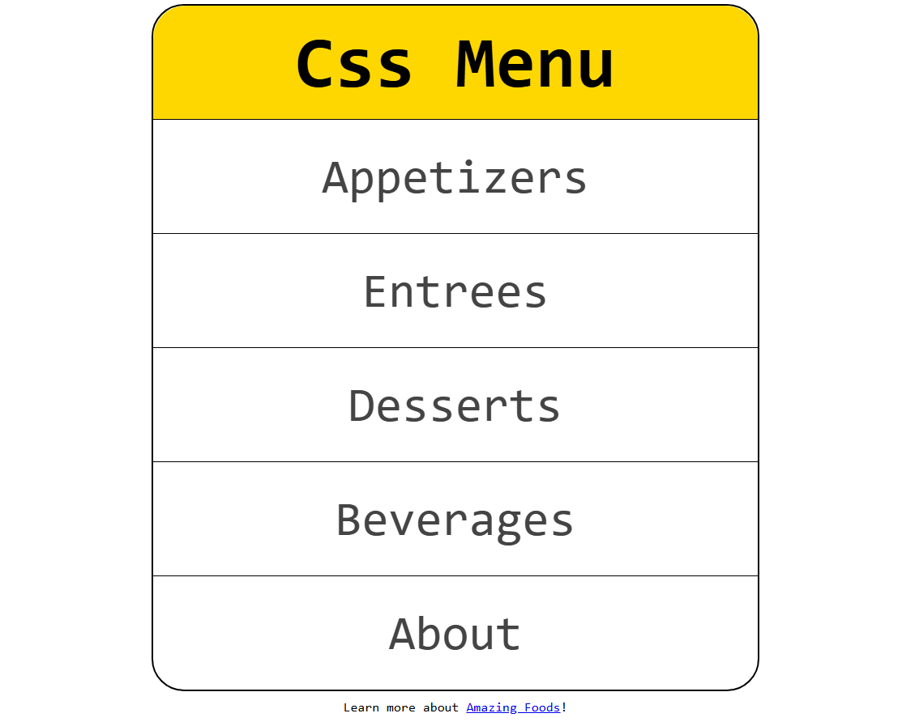

# 🍽️ Simple CSS Menu

A clean and stylish vertical navigation menu built with pure HTML and CSS. Ideal for beginner projects, landing pages, or demonstrations without JavaScript.

## 📸 Preview

_Add a screenshot here if you like:_  
```markdown

```

## 📁 Project Structure

```
project-folder/
├── html/
    └── index.html         # Main page with the menu
    └── one.html           # Page for Appetizers and Entrees
    └── two.html           # Page for Desserts, Beverages, About
├── css/
│   └── style.css      # Menu styling
└── images/
    └── preview.png    # screenshot
```

## 🚀 How to Use

1. Clone the repository:
   ```bash
   git clone https://github.com/username/simple-css-menu.git
   ```

2. Open `index.html` in your browser.

3. Done! The menu is fully functional.

## 🖌️ CSS Styling Overview (`style.css`)

```css
* {
    margin: 0;
    padding: 0;
    box-sizing: border-box;
}

body {
    text-align: center;
    font-family: monospace;
    margin: 0.5rem;
}

nav {
    border: 2px solid black;
    margin: 0 auto 0.5rem;
    border-radius: 2rem;
    max-width: 600px;
    font-size: 3rem;
    line-height: 7rem;
}

ul {
    list-style-type: none;
}

h2 {
    background-color: gold;
    border-radius: 2rem 2rem 0 0;
}

li {
    border-top: 1px solid black;
}

li a {
    display: block;
    text-decoration: none;
    color: #444;
}

li a:hover,
li a:focus {
    background-color: #444;
    color: aliceblue;
}

li:last-child a {
    border-radius: 0 0 2rem 2rem;
}
```

### 📌 Style Highlights

- Centered menu with border and rounded corners
- Bold `h2` heading with gold background
- Smooth hover effect: dark background with light text
- No JavaScript, no list bullets, responsive basics

## 📄 License

MIT — free to use and adapt.
